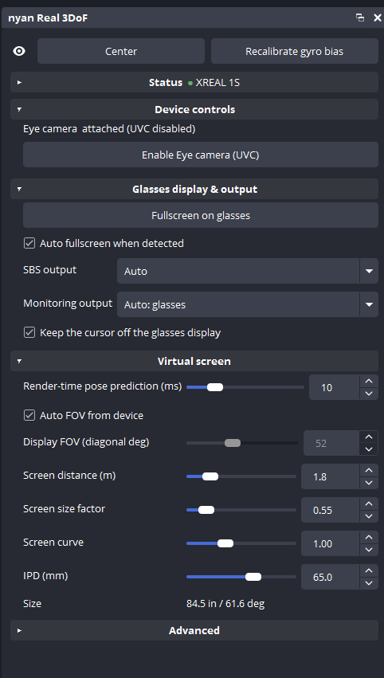
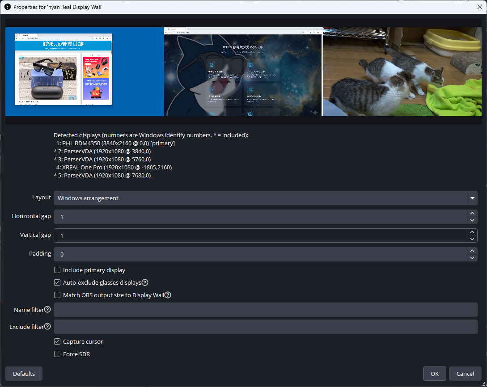
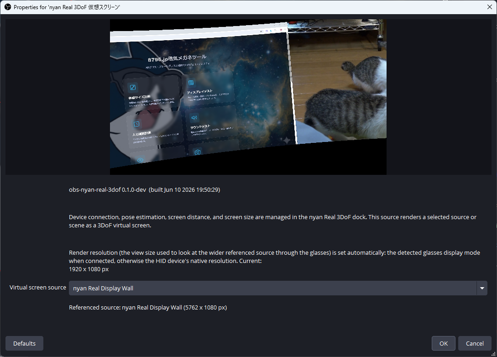

# obs-nyan-real-3dof

*English · [日本語](README.md)*

Small OBS Studio plugin that reads IMU data from HID-detected AR glasses
(XREAL, RayNeo, EPSON MOVERIO, Rokid, VITURE and Nreal Light) and warps an OBS source as a head-tracked virtual screen.

Module/DLL: `obs-nyan-real-3dof`  
Sources: `nyan Real 3DoF Virtual Screen` / `nyan Real Display Wall`

## Install

Download the installer (`*-installer.exe`) or the portable ZIP from
[Releases](https://github.com/8796n/obs-nyan-real-3dof/releases). Close OBS
before running the installer. For the ZIP, extract the `obs-nyan-real-3dof`
folder into `%ProgramData%\obs-studio\plugins\`. To build from source, see
"Build" below.

## What It Does

```text
HID device detection (XREAL / RayNeo / EPSON MOVERIO / Rokid / VITURE / Nreal Light)
  -> One-family: TCP 169.254.2.1:52998, 134-byte IMU/MAG record parser
  -> Air-family / RayNeo Air-family / Rokid: HID input report IMU/MAG stream
  -> EPSON MOVERIO: IMU/MAG through the Windows Sensor API
  -> VITURE: on-device fused orientation stream over HID input reports
  -> Nreal Light: raw IMU stream from the OV580 coprocessor over HID
  -> gyro + accel pose tracker
  -> optional MAG yaw correction
  -> display mode switching (Air family / Nreal Light: 2D/3D SBS, refresh rate) + SBS output rendering
  -> virtual-screen input source in OBS
  -> spatial audio filter (head-tracked pan + screen-distance attenuation)
  -> Display Wall's spatial audio (Audio Wall) group (auto-detects playing apps -> spatial mix by window position)
  -> Chrome extension link (tab audio over WebSocket, follows window position / tools/chrome-extension)
  -> phone remote (scan a QR code on the same Wi-Fi -> touchpad + center/recalibrate/screen-distance remote)
```

This is intentionally separate from `obs-near-real3d`: there is no ONNX model,
DirectML runtime, monocular depth, SBS generation, or audio sync management.

## Build

Install OBS Studio first, then run:

```powershell
.\setup.ps1
.\build.ps1
.\install.ps1
```

`setup.ps1` uses `..\obs_real3d\deps` as a local cache when present. Otherwise it
clones OBS headers matching the installed OBS version and generates `obs.lib`
from `obs.dll`.

## Use

1. Connect supported glasses (XREAL / RayNeo / EPSON MOVERIO / Rokid / VITURE / Nreal Light) by USB and make sure they
   enumerate as HID.
2. Start OBS.
3. Show the `nyan Real 3DoF` dock from the Docks menu.
4. Use the dock to check the device, connection state, screen distance, size,
   and curve.
5. Add `nyan Real 3DoF Virtual Screen` as a source.
6. In that source's properties, choose the OBS source or scene to render as the
   virtual screen (for a multi-display wall, pick the `nyan Real Display Wall`
   source directly — see the tutorial below).
7. Face forward and click `Center`. (The render resolution of the view
   follows the glasses automatically, e.g. `1920 x 1080`.)
8. To show it on the glasses, click `Fullscreen on glasses` in the dock (it
   opens a source projector on the EDID-identified glasses display), or
   right-click the virtual-screen source and choose
   `Fullscreen Projector (Source)`, then pick the glasses display. Use a
   **Source** projector, not a Preview/Program (canvas) projector.

Displaying on the glasses must use the virtual-screen source's
`Fullscreen Projector (Source)`, not a Preview/Program (canvas) projector. A
canvas projector shows the whole OBS base canvas, so a wide canvas
(e.g. `3840 x 1080`) is scaled down to the glasses resolution and you cannot look
around. A source projector shows only the virtual-screen source render resolution
(e.g. `1920 x 1080`), so you can pan across the wider referenced source by turning
your head.

## Tutorial: a multi-display wall on your glasses

This walks through the flagship setup, starting from the goal.

**Goal:** pin several displays (physical or virtual ones created with tools like
[ParsecVDisplay](https://github.com/nomi-san/parsec-vdd)) to one large fixed
virtual screen in your AR glasses, and look at each display by turning your head.

**End state:** two scenes. A `Wall` scene (it holds the Display Wall source,
which combines the display captures into one picture) and a `Glasses` scene
(the virtual-screen source references the Display Wall **source** directly and
warps it). The virtual-screen source goes to the glasses display through a
source projector, and everything is tuned in the dock.

**Prerequisites:**

- the plugin is installed and OBS has been restarted
- the glasses are connected by USB (HID; the dock in step 1 confirms this)
- the displays you want to combine are active in Windows (if you need more,
  add virtual displays with a driver such as
  [ParsecVDisplay](https://github.com/nomi-san/parsec-vdd))

### Step 1: show the dock

`Docks` menu → `nyan Real 3DoF`.

**Why:** the dock shows device detection, IMU connection, and pose calibration
state, and it holds the Center button and the screen settings used later.
Keeping it visible lets you verify each following step on the spot. When
`Device (HID)` shows your glasses, the connection side is ready.



### Step 2: create the `Wall` scene with a Display Wall

Create a new scene `Wall` and add the source `nyan Real Display Wall`.

**Why:** it captures multiple Windows displays and arranges them into one
texture automatically. You could place individual display-capture sources by
hand, but the Display Wall automates layout, gaps, and canvas-size tracking.

Key points in the properties:

- Check the detected display list (`*` = included). The numbers match Windows
  Identify.
- The glasses display is excluded automatically: `Auto-exclude glasses
  displays` (on by default) identifies supported glasses panels by their EDID.
  If it were part of the wall, it would capture its own output — a feedback
  loop. Use `Exclude filter` for any additional manual exclusions, or uncheck
  `Include primary display` to drop the primary display.
- Leave `Match OBS output size to Display Wall` off. **Why:** it is only
  needed when the wall is referenced through a scene (a scene always reports
  the OBS canvas size). The next step references the Display Wall source
  directly, so the canvas can stay small and OBS does not composite a
  wall-sized canvas every frame.



### Step 3: create the `Glasses` scene with a virtual screen

Create a new scene `Glasses`, add the source `nyan Real 3DoF Virtual Screen`,
and set its `Virtual screen source` property to the **source**
`nyan Real Display Wall` — the Display Wall itself, not the `Wall` scene.

**Why reference the source directly:** a scene always reports the OBS canvas
size, so referencing the `Wall` scene only shows the whole wall after the
canvas is grown to the wall size (`Match OBS output size`). Referencing the
Display Wall source directly samples the wall at its native combined size,
the OBS canvas can stay at e.g. `1920 x 1080`, and OBS skips compositing a
huge canvas every frame — noticeably lighter on the GPU. The `Wall` scene
from step 2 then simply holds the source and lets you inspect the layout.

- The render resolution (the view you look through) is set automatically to
  the glasses display resolution, e.g. `1920 x 1080` — not the wall size. The
  wall stays larger than the view, and you pan across it by turning your head.



### Step 4: send the view to the glasses

The quickest way is the dock: click `Fullscreen on glasses` and the source
projector opens on the EDID-identified glasses display. Check
`Auto fullscreen when detected` to open it automatically whenever the glasses
connect (once per connection). An existing projector on the glasses display is
closed first, so projectors never stack. When the glasses display disconnects,
projectors that were on it are closed automatically instead of migrating to
another monitor.

Manual alternative: right-click the virtual-screen source in the `Glasses`
scene → `Fullscreen Projector (Source)` → the glasses display.

**Why a source projector:** a Preview/Program projector shows the OBS canvas —
it follows scene switches and scales whenever the canvas size differs from the
glasses resolution. The source projector outputs exactly the virtual-screen
view at its render resolution, pinned to the glasses regardless of which scene
is active in OBS.

### Step 5: calibrate and center

Right after connecting, keep the glasses still for a few seconds (gyro bias
calibration; the dock `Pose` row turns `Calibrated`). Then face the direction
you want as "front" and click `Center`.

**Why:** the IMU only measures changes in rotation, so you have to tell it
where front is. `Center` is also assignable as an OBS hotkey.

### Step 6: adjust the screen

Tune `Screen distance` / `Screen size factor` / `Screen curve` in the dock. The
resulting size (inches / apparent angle) is shown in the `Size` row.

**Why:** distance and size decide how large the wall appears — that is, how far
you need to turn your head to scan it. Curve bends a very wide wall around you
so the edges stay readable.

### Troubleshooting

- `Device (HID)` shows none → check USB and that the model is supported; new
  models can be added via `devices.json` (see below)
- `IMU` stays Waiting (One family) → check the glasses' USB Ethernet connection
  and that IP/port are still at defaults
- Picture in the glasses but you cannot look around → the projector is a
  Preview/Program one instead of a Source projector (redo step 4)
- The view slowly drifts → put the glasses on a desk so they are completely
  still and click `Recalibrate gyro bias`. Calibration rejects windows with
  movement and retries, so the dock `Pose` row stays `Calibrating` until a
  quiet window is captured
- `Fullscreen on glasses` is grayed out → the dock's `Glasses display` row
  shows `not detected`; the panel's EDID is not recognized — add
  `edid_vendor` / `edid_product` to `devices.json`

## Display Wall

The `nyan Real Display Wall` source combines multiple Windows display captures
into one OBS source. It is meant for virtual displays created by tools such as
[ParsecVDisplay](https://github.com/nomi-san/parsec-vdd) (Parsec VDD): arrange
them by mirroring the Windows system display arrangement
(the default), in auto columns, or with a row layout such as `1,2,3 / 4,5`. The
combined wall size becomes the source size. `Horizontal gap`, `Vertical gap`,
and `Padding` add space between displays. Windows arrangement mode keeps OS
coordinates as the base and inserts the configured gaps between detected
columns/rows.

Add this source first, then select it as the target of `nyan Real 3DoF Virtual
Screen` to view several displays as one large virtual screen. By default it
mirrors the Windows display arrangement including the primary display, and
excludes any display whose EDID identifies it as supported AR glasses
(`Auto-exclude glasses displays`). Use `Exclude filter` to omit additional
displays by detected number or name, or uncheck `Include primary display` to
drop the primary. Detected display numbers follow the numbers shown by Windows
Identify.

`Match OBS output size to Display Wall` updates the OBS base canvas and output
resolution after the Display Wall combined size changes. It is only needed when
the wall is referenced through a scene (a scene reports the canvas size, so a
small canvas would crop the wall) or when you want the OBS canvas itself to
show the whole wall. With the recommended direct source reference it can stay
off, which keeps the canvas small and the per-frame compositing cost low. Sync
waits while streaming, recording, virtual camera, or replay buffer output is
active.

The virtual-screen render resolution (the view it outputs back to OBS) is set
automatically: the detected glasses display mode while the glasses are
connected, otherwise the HID-detected device's native resolution. It is
separate from the referenced source size and the physical virtual screen size
in XREAL.

The model (XREAL One / One Pro / 1S / ROG XREAL R1 / Air / Air 2, RayNeo Air
series, EPSON MOVERIO BT-40 / BT-30C, Rokid Max / Air, VITURE One / One Lite / Pro, Nreal Light) is auto-detected over HID; the connection and warp start only after HID
identifies a supported device. The detected device controls the mount offset and
display FOV; turn off `Auto FOV from device` to set the FOV manually.

The detection table is user-extensible: place a `devices.json` at
`%AppData%\obs-studio\plugin_config\obs-nyan-real-3dof\devices.json` to add
devices or override built-in profiles without rebuilding (see the bundled
`data/devices-example.json` for the format). For example, a new Air-protocol
model can be supported by copying the Air entry and changing the PID. Entries
can also carry the display panel's EDID identity (`edid_vendor` /
`edid_product` / `edid_name_contains`), which feeds the glasses-display
auto-exclusion and the dock's fullscreen-projector button; XREAL (`MRG`) and
RayNeo Air (`TCL` 03D4 / "SmartGlasses") are built in.

`Screen distance` and `Screen size factor` control the fixed virtual screen size.
`Screen curve` bends the screen horizontally from flat (`0.0`) toward a
viewer-centered cylinder (`1.0`), and can go up to a stronger experimental
curve (`3.0`) for very wide screens. This helps keep wide-screen edges readable.
The default is 1.0 m / 0.25x, which puts roughly a 37-inch screen (for a
50-degree FOV device) at 1 m — close to a desktop monitor — with curvature off.
`IPD` is the eye separation used for SBS output (default 63 mm). Set it to your
interpupillary distance and the virtual screen converges stereoscopically at the
configured screen distance (the eyes naturally converge more as the distance
shrinks). It has no effect while SBS output is off.
These settings are global in the dock; the virtual-screen source only renders
the warp from the shared pose and screen state.

If the glasses' HID interface is not detected, disconnects, or the TCP stream is
unavailable, the virtual screen passes the texture through without blocking OBS.
`Center` is also available as an assignable OBS hotkey.

## Phone remote

A remote for driving the PC while wearing the glasses. No app install: any
phone (Android / iPhone) on the same Wi-Fi works from its browser.

1. In the dock's `Phone remote` section, enable `Accept remote control from a
   phone`. Choose "Allow access" if Windows Firewall asks on first enable.
2. Scan the QR code with the phone's camera and use the page that opens.
   On iPhone, `Add to Home Screen` launches it fullscreen; on Android use
   the ⛶ button on the page. While a phone is connected, the dock swaps the
   QR code for a "Remote connected" line (the QR is not invalidated — it
   reappears when the connection drops).

The page is a touchpad in the middle (1 finger moves, tap = left click,
press and hold to start a drag — the left button stays held while the border
is green; lifting releases it, but a brief lift and re-touch continues the
drag, so long drags can be done in strokes — 2 fingers scroll, 2-finger tap =
right click), `Center` / `Recalibrate` at the top, and a `distance` wheel
strip on the right edge: swipe down to walk **toward the point you are
looking at**, swipe up to back away (the viewpoint moves along your gaze, so
you can step up to a side display of a wide wall; the screen itself stays
put). `Center` also resets your standing position.

Commands are gated by the random token in the URL, so devices that did not
scan the QR code are rejected. The token and port (default 8797) persist in
the settings, so a scanned QR keeps working across OBS restarts. One phone
controls at a time; the most recently connected device wins. To invalidate
the token (someone saw your QR), click the QR code, or use the
`Disconnect & issue a new QR` button while connected. Networks
that isolate clients from each other (hotel Wi-Fi AP isolation) will not
work; tether the PC to the phone's hotspot instead.

## Package

```powershell
.\package.ps1
```

The portable ZIP and optional Inno Setup installer are written to `dist/`.

## License

GPL-2.0-or-later. See `LICENSE` and `THIRD_PARTY_LICENSES`.
