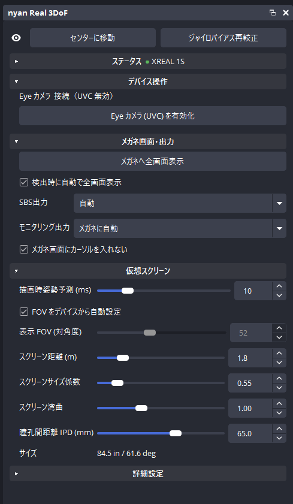
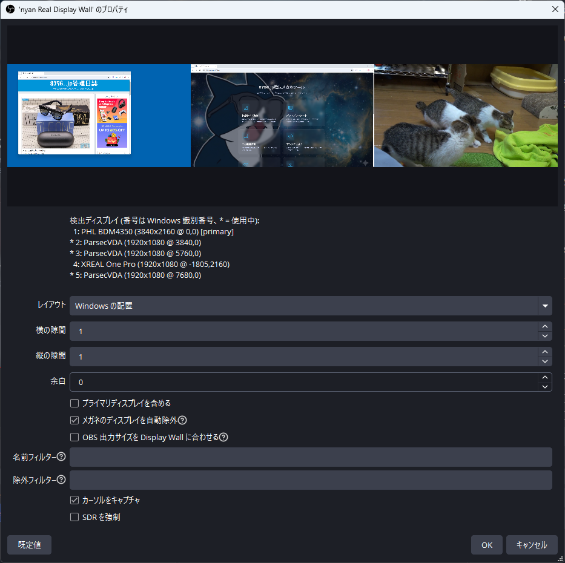
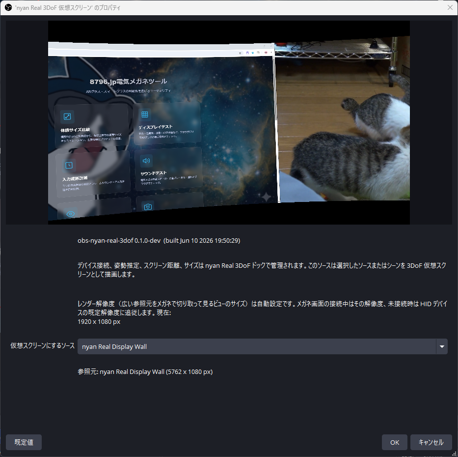

# obs-nyan-real-3dof

*[English](README.en.md) · 日本語*

HID で判別した AR グラス（XREAL / RayNeo / EPSON MOVERIO / Rokid）の IMU データを読み取り、OBS のソースを
ヘッドトラッキング連動の仮想スクリーンとしてワープさせる、小さな OBS Studio 用
プラグインです。

モジュール/DLL: `obs-nyan-real-3dof`
ソース: `nyan Real 3DoF 仮想スクリーン` / `nyan Real Display Wall`

## インストール

[Releases](https://github.com/8796n/obs-nyan-real-3dof/releases) からインストーラー
（`*-installer.exe`）またはポータブル ZIP をダウンロードします。インストーラーは
OBS を終了してから実行してください。ZIP の場合は `obs-nyan-real-3dof` フォルダーを
`%ProgramData%\obs-studio\plugins\` へ展開します。ソースからビルドする場合は
後述の「ビルド」を参照してください。

## できること

```text
HID device detection (XREAL / RayNeo / EPSON MOVERIO / Rokid)
  -> One-family: TCP 169.254.2.1:52998、134 バイトの IMU/MAG レコードのパース
  -> Air-family / RayNeo Air-family / Rokid: HID 入力レポートの IMU/MAG ストリーム
  -> EPSON MOVERIO: Windows Sensor API 経由の IMU/MAG
  -> ジャイロ + 加速度による姿勢トラッキング
  -> 任意で MAG ヨー補正
  -> OBS 内での仮想スクリーンソース描画
```

本プラグインは `obs-near-real3d` とは意図的に別物です。ONNX モデル、DirectML
ランタイム、単眼深度推定、SBS 生成、音声同期管理などは一切含みません。

## ビルド

先に OBS Studio をインストールしてから、次を実行します。

```powershell
.\setup.ps1
.\build.ps1
.\install.ps1
```

`setup.ps1` は、存在する場合は `..\obs_real3d\deps` をローカルキャッシュとして利用
します。無い場合は、インストール済みの OBS バージョンに合った OBS ヘッダーを clone し、
`obs.dll` から `obs.lib` を生成します。

## 使い方

1. 対応するグラス（XREAL / RayNeo / EPSON MOVERIO / Rokid）を USB で接続し、HID デバイスとして認識させます。
2. OBS を起動します。
3. `ドック` メニューから `nyan Real 3DoF` ドックを表示します。
4. ドックでデバイス、接続状態、スクリーン距離/サイズ/湾曲を確認します。
5. `nyan Real 3DoF 仮想スクリーン` をソースとして追加します。
6. そのソースのプロパティで、仮想スクリーンとして描画する OBS ソースまたはシーンを選びます（複数ディスプレイの wall を見る場合は `nyan Real Display Wall` ソースを直接選びます。後述のチュートリアル参照）。
7. 正面を向いて `センターに移動` をクリックします（ビューのレンダー解像度はメガネに合わせて自動設定されます。例: `1920 x 1080`）。
8. メガネへ表示するときは、ドックの `メガネへ全画面表示`（EDID で判別したメガネのディスプレイへソースプロジェクターを開きます）を押すか、仮想スクリーンソースを右クリックして `全画面プロジェクター (ソース)` を選び、メガネのディスプレイに出します。シーン（プレビュー/プログラム）のプロジェクターではなく、必ずソースのプロジェクターを使ってください。

メガネへの表示は、シーン（プレビュー/プログラム）ではなく仮想スクリーンソースの
`全画面プロジェクター (ソース)` を使うのが重要です。プレビュー/プログラムのプロジェクターは
OBS ベースキャンバス全体を映すため、キャンバスが広い（例: `3840 x 1080`）とメガネ解像度に
縮小されて表示され、首を振っても見回せません。ソースのプロジェクターは仮想スクリーンソースの
レンダー解像度（例: `1920 x 1080`）だけを映すので、広い参照元を首振りで切り取って見られます。

## チュートリアル: 複数ディスプレイをメガネで見渡す

本命の使い方を、ゴールから逆算して一通り説明します。

**ゴール:** 複数のディスプレイ（物理でも、[ParsecVDisplay](https://github.com/nomi-san/parsec-vdd)
などで作った仮想でも）を 1 枚の大きな仮想スクリーンとして AR グラスに固定表示し、
見たい画面の方へ首を向けて見る。

**完成形:** シーンが 2 つできます。`Wall` シーン（Display Wall ソースの置き場所。
ディスプレイ群を 1 枚に合成）と `Glasses` シーン（仮想スクリーンが Display Wall
**ソースを直接**参照してワープ）。仮想スクリーンソースをソースプロジェクターで
メガネのディスプレイへ出力し、調整はすべてドックで行います。

**前提:**

- プラグインをインストール済みで、OBS を再起動している
- グラスを USB で接続している（HID 認識。手順 1 のドックで確認できます）
- 並べたいディスプレイが Windows 上でアクティブになっている（物理ディスプレイが
  足りない場合は [ParsecVDisplay](https://github.com/nomi-san/parsec-vdd) のような
  仮想ディスプレイドライバーで追加できます）

### 手順 1: ドックを表示する

`ドック` メニュー → `nyan Real 3DoF`。

**なぜ必要か:** デバイスの検出状態・IMU 接続・姿勢較正の状態がここに表示され、
センター合わせとスクリーン調整もここで行います。最初に出しておくと、以降の各手順の
結果をその場で確認できます。`デバイス (HID)` にグラス名が出ていれば接続準備は完了です。



### 手順 2: `Wall` シーンを作って Display Wall を追加する

新しいシーン `Wall` を作成し、ソース `nyan Real Display Wall` を追加します。

**なぜ必要か:** 複数のディスプレイキャプチャを 1 枚のテクスチャに自動配置するためです。
個別の「画面キャプチャ」ソースを手で並べても同じ絵は作れますが、Display Wall は配置・
隙間・キャンバスサイズの追従を自動化します。

プロパティでの要点:

- 検出ディスプレイ一覧（`*` が対象）を確認します。番号は Windows の「識別」と同じです。
- メガネのディスプレイは自動で除外されます（`メガネのディスプレイを自動除外`、既定 ON。
  対応グラスのパネルを EDID で判別します）。メガネへ出力する画面が wall に含まれると、
  自分の出力を自分でキャプチャする合わせ鏡になるためです。追加で外したい画面は
  `除外フィルター` で指定するか、`プライマリディスプレイを含める` を OFF にします。
- `OBS 出力サイズを Display Wall に合わせる` は OFF のままにします。**なぜ:** これは
  wall をシーン経由で参照する場合にだけ必要な設定です（シーンのサイズは常に OBS
  キャンバスサイズになるため）。次の手順では Display Wall ソースを直接参照するので、
  キャンバスは小さいままでよく、wall サイズの巨大なキャンバスを毎フレーム合成せずに
  済みます。



### 手順 3: `Glasses` シーンを作って仮想スクリーンを追加する

新しいシーン `Glasses` を作成し、ソース `nyan Real 3DoF 仮想スクリーン` を追加して、
プロパティの参照元（`仮想スクリーンにするソース`）に **ソース**
`nyan Real Display Wall` を選びます。`Wall` シーンではなく Display Wall ソース
そのものを選ぶのがポイントです。

**なぜソースを直接参照するか:** シーンのサイズは常に OBS キャンバスサイズになるため、
`Wall` シーンを参照すると、キャンバスを wall サイズへ広げないと全体が映りません
（`OBS 出力サイズを合わせる` が必要になる）。Display Wall ソースを直接参照すれば
wall を合成後のネイティブサイズのままサンプリングでき、OBS キャンバスは
`1920 x 1080` などのままでよく、巨大キャンバスの毎フレーム合成が消える分 GPU が
明確に軽くなります。手順 2 の `Wall` シーンは「ソースの置き場所 + 配置の確認用」です。

- レンダー解像度（メガネ越しに覗くビューの解像度）は、メガネの表示解像度
  （例: `1920 x 1080`）へ自動設定されます。wall 全体のサイズとは別物で、wall は
  ビューより大きいまま残り、首振りでその中を見渡します。



### 手順 4: メガネへ出力する

いちばん簡単なのはドックです。`メガネへ全画面表示` を押すと、EDID で判別したメガネの
ディスプレイへソースプロジェクターが開きます。`検出時に自動で全画面表示` を ON に
すると、メガネ接続のたびに自動で開きます（接続ごとに 1 回）。メガネ画面上の既存
プロジェクターは先に閉じてから開くため、多重には開きません。メガネのディスプレイが
切断されたときは、そこにあったプロジェクターを自動で閉じます（他のモニターへ
引っ越してくることはありません）。

手動で行う場合: `Glasses` シーン内の仮想スクリーンソースを右クリック →
`全画面プロジェクター (ソース)` → メガネのディスプレイを選びます。

**なぜソースのプロジェクターか:** プレビュー/プログラムのプロジェクターは OBS キャンバスを
映すため、シーン切り替えに追従してしまい、キャンバスサイズがメガネ解像度と違えば縮小も
入ります。ソースのプロジェクターは仮想スクリーンソースのビューをレンダー解像度のまま
メガネに固定表示するので、OBS 側でどのシーンを操作していても表示が崩れません。

### 手順 5: 較正してセンターを合わせる

接続直後はグラスを数秒静止させます（ジャイロバイアス較正。ドックの `姿勢` が
`較正済み` になります）。次に正面にしたい方向を向いて `センターに移動` を押します。

**なぜ必要か:** IMU は回転の変化しか測れないため、「どこが正面か」はユーザーが教える
必要があります。センターは OBS のホットキーにも割り当てられます。

### 手順 6: 見え方を調整する

ドックの `スクリーン距離` / `スクリーンサイズ係数` / `スクリーン湾曲` を好みに合わせます。
結果のサイズ（インチ / 見かけの角度）は `サイズ` 行に表示されます。

**なぜ必要か:** 距離とサイズは「wall がどれくらい大きく見えるか = 見渡すのに必要な首の
振り幅」を決めます。湾曲は横長の wall を視点中心に曲げ、左右端の読みやすさを上げます。

### うまくいかないとき

- `デバイス (HID)` が「なし」→ USB 接続と対応機種かを確認。新機種は `devices.json` で
  追加できます（後述）
- `IMU` が「待機中」のまま（One 系）→ グラス側の USB Ethernet 接続と、IP/ポートが
  既定値のままかを確認
- メガネに映るが見回せない → プロジェクターが「ソース」ではなく
  「プレビュー/プログラム」になっています（手順 4 をやり直し）
- 視点がじわじわ流れる（ドリフト）→ グラスを机などに置いて完全に静止させ、
  `ジャイロバイアス再較正` を押します。較正は動きを検出すると自動でやり直すため、
  静止するまでドックの `姿勢` は「較正中」のままになります
- `メガネへ全画面表示` が押せない（グレー表示）→ ドックの `メガネ画面` 行が
  「未検出」です。パネルの EDID を判別できていないので、`devices.json` に
  `edid_vendor` / `edid_product` を追加します

## Display Wall

`nyan Real Display Wall` ソースは、複数の Windows ディスプレイキャプチャを 1 つの
OBS ソースにまとめます。[ParsecVDisplay](https://github.com/nomi-san/parsec-vdd)（Parsec
VDD）などで増やした仮想ディスプレイを、Windows の
システム設定と同じディスプレイ配置（既定）、列数による自動配置、または
`1,2,3 / 4,5` のような行レイアウトで並べ、合成後のサイズをソースサイズとして返します。自動配置/行レイアウトでは
`横の隙間` / `縦の隙間` / `余白` で画面間にスペースを作れます。Windows 配置では OS の
座標をベースに、検出された列/行の間へ隙間を追加します。

このソースを作ってから、`nyan Real 3DoF 仮想スクリーン` の参照元に選ぶと、複数画面を
1 枚の大きな仮想スクリーンとして見渡せます。初期設定では Windows のディスプレイ配置を
そのまま再現し（プライマリディスプレイ含む）、EDID から対応 AR グラスと判別した
ディスプレイ（`メガネのディスプレイを自動除外`）だけを除外します。さらに外したい画面は
検出一覧の番号や名前を `除外フィルター` に入れるか、`プライマリディスプレイを含める` を
OFF にします。検出一覧の番号は Windows の「識別」で表示される番号に合わせます。

`OBS 出力サイズを Display Wall に合わせる` を ON にすると、Display Wall の合成サイズ変更後に
OBS のベースキャンバスと出力解像度を同じサイズへ更新します。これが必要なのは wall を
シーン経由で参照する場合（シーンのサイズはキャンバスサイズになるため、小さいキャンバスでは
wall が切れる）や、OBS のキャンバス自体に wall 全体を映したい場合だけです。推奨構成の
ソース直接参照では OFF のままでよく、キャンバスが小さいまま毎フレームの合成コストを
抑えられます。配信、録画、仮想カメラ、リプレイバッファの動作中は反映を待ちます。

仮想スクリーンのレンダー解像度（OBS へ出力するビューの解像度）は自動設定です。
メガネ画面の接続中はその実解像度、未接続時は HID で判別したデバイスの既定解像度に
追従します。参照元ソースのサイズや XREAL 内で見える仮想スクリーンの物理サイズとは
別物です。

機種（XREAL One / One Pro / 1S / ROG XREAL R1 / Air / Air 2、RayNeo Air 系、EPSON MOVERIO BT-40、Rokid Max / Air）は HID で
自動判別され、HID が取れてから接続とワープが開始します。装着オフセットと表示 FOV は
判別したデバイスに合わせて設定され、`FOV をデバイスから自動設定` を OFF にすると FOV を
手動で調整できます。

判別テーブルはユーザーが拡張できます。`%AppData%\obs-studio\plugin_config\obs-nyan-real-3dof\devices.json`
を置くと、再ビルドなしで機種の追加や組み込みプロファイルの上書きができます（書式は同梱の
`data/devices-example.json` を参照）。たとえば Air 系プロトコルの新機種は、Air のエントリを
コピーして PID を書き換えるだけで動かせます。エントリには表示パネルの EDID 識別子
（`edid_vendor` / `edid_product` / `edid_name_contains`）も書け、メガネディスプレイの
自動除外とドックの全画面表示ボタンに使われます。XREAL（`MRG`）と RayNeo Air
（`TCL` 03D4 / "SmartGlasses"）は組み込み済みです。

`スクリーン距離` と `スクリーンサイズ係数` で固定仮想スクリーンの大きさを調整できます。
`スクリーン湾曲` は横方向だけを、平板 (`0.0`) から視点中心の円筒に近い形 (`1.0`) へ曲げます。
かなり横長の画面向けに、実験的な強めの湾曲 (`3.0`) まで上げられます。
ワイド画面の端を読みやすくしたい場合に使います。既定は flinger と同じ 4.0m / 1.0x で、
50° FOV の機種では約 147 インチ相当、湾曲は OFF です。
これらの設定はドックでグローバル管理され、仮想スクリーンソースは共有の姿勢・スクリーン
設定を使ってワープ描画だけを行います。

グラスの HID が未検出、切断、または TCP ストリームが利用できない場合、仮想スクリーンは
OBS をブロックせずにテクスチャをそのまま通過させます。`センターに移動` は OBS のホットキーにも割り当てできます。

## パッケージング

```powershell
.\package.ps1
```

ポータブル ZIP と、任意で Inno Setup インストーラーが `dist/` に出力されます。

## ライセンス

GPL-2.0-or-later。`LICENSE` および `THIRD_PARTY_LICENSES` を参照してください。
